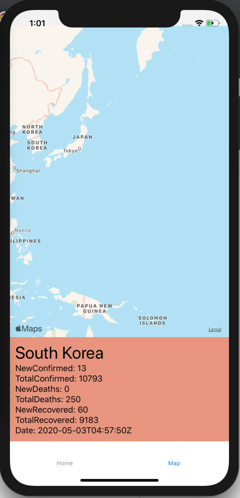

# COVID-19 APP
For this app, there is are two pages that you can move back and forth with the bottom tab. The pages are home and map. When you click on map, you are presented with a world map. When you press on a country, it will show the data of "NewConfirmed, TotalConfirmed, NewDeaths, TotalDeaths, NewRecovered, TotalRecovered, and Date" for each country. Using reac-native, this a multi-platform app and is receive the current covid-19 data from the covid19 api. I used geocoder so that given the coordinates from clicking on a country, it will know which country it is and output that country's name. With that country's name now given, it will be used for the covid-19 api to grab data from that country and display it on a view below the Map. I chose not to use marker because it looked cleaner without it. I have added the commented out code of the marker code that i used before.

